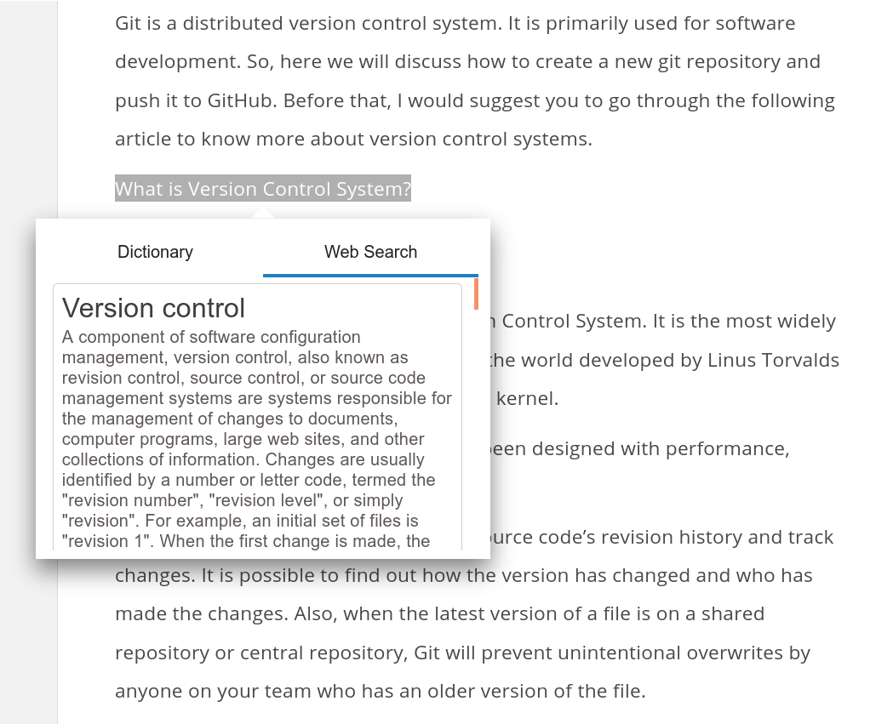

# assistme
It helps make browsing experience better by providing realtime information on the current webpage itself.

## Features
* Gives a dictionary meaning of the selected text
* Gives web search results for the selected text
* Caches the recent searches results
* Simple and clean window to display results
* More to come...

## How it works?
Steps:
* Select a piece of text
* A search icon appears
* Hover over the search icon
* Results for the selected piece of text appears

## Illustrations
 

 

## APIs used
* [DuckDuckGo API](https://api.duckduckgo.com)
* [Dictionary API](https://dictionaryapi.dev/)

## Future
More and more new features will be added to improve the browsing experience further.
